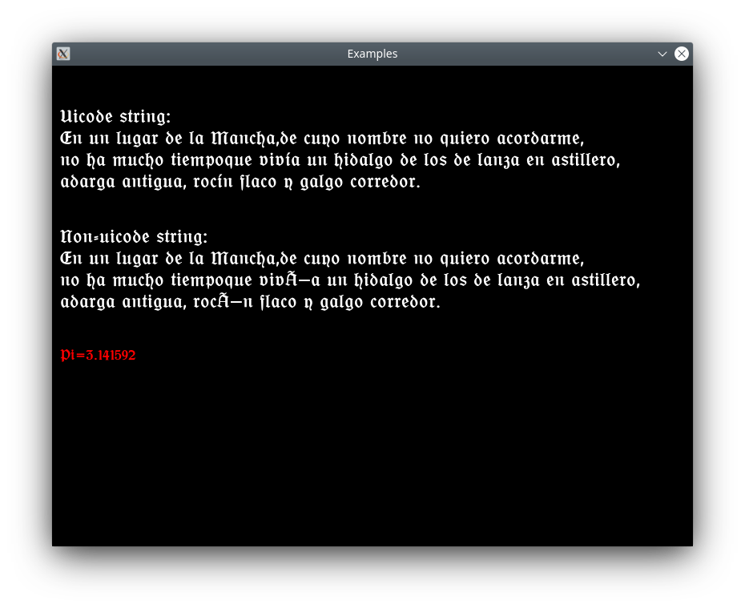

# DrawText

An easy to use class for writting texto into an SDL_Surface using SDL_ttf.

# Example
    ...
    init();
    
    // Init DrawText object
    SDL_Color white = {255,255,255,0};
    SDL_Color red = {255,0,0,0};
    
    DrawText *text = new DrawText("fonts/OfenbacherSchwabCAT.ttf", 25, white);
    DrawText *redText = new DrawText("fonts/OfenbacherSchwabCAT.ttf", 20, red);
    
    // Print some text
    text->print(screen,
                DrawText::format(L"Uicode string:\nEn un lugar de la Mancha,"
                                 "de cuyo nombre no quiero acordarme,\nno ha mucho tiempo"
                                 "que vivía un hidalgo de los de lanza en astillero,"
                                 "\nadarga antigua, rocín flaco y galgo corredor."),
                10, 50);

    text->print(screen,
                DrawText::format("Non-uicode string:\nEn un lugar de la Mancha,"
                                 "de cuyo nombre no quiero acordarme,\nno ha mucho tiempo"
                                 "que vivía un hidalgo de los de lanza en astillero,"
                                 "\nadarga antigua, rocín flaco y galgo corredor."),
                10, 200);

    redText->print(screen, DrawText::format("Pi=%f", 3.141592), 10, 350);
    
    mainLoop();
    ...
# Screenshot


# Dependencies
* SDL2
* SDL_ttf

# Build Instructions
```
cd build 
cmake ..
make
```


